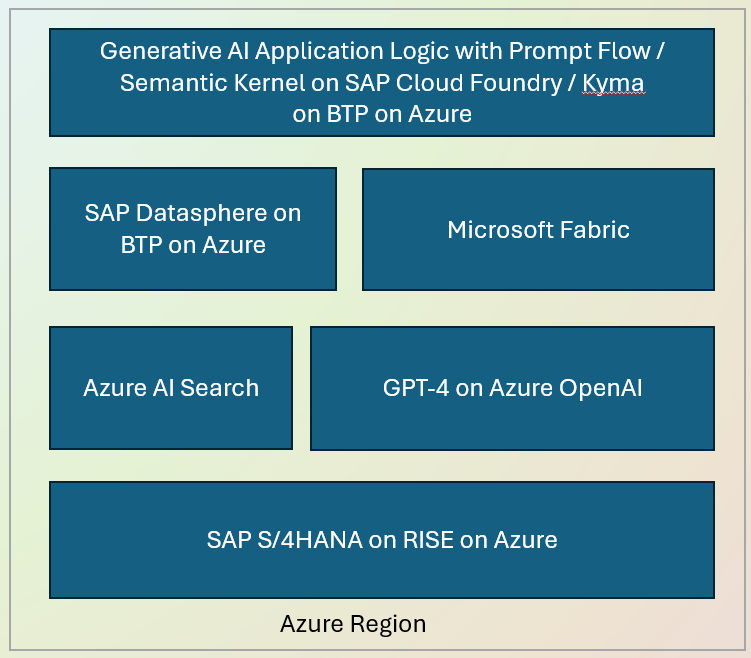

# Generative AI App Template for SAP BTP using Prompt Flow and Azure OpenAI GPT-4

## Introduction
The Generative AI App Template empowers SAP customers, partners, and architects to harness the power of Generative AI within their SAP environments. By seamlessly integrating SAP Business Technology Platform (BTP) with Azure OpenAI GPT-4, this Prompt Flow python app template enables the development of intelligent applications that automate tasks, enhance decision-making, and drive efficiency.

## Problem Addressed
1. **Manual and Repetitive Tasks**:
   - Many business processes involve repetitive tasks that consume valuable time and resources.
   - Lack of seamless integration between SAP systems and advanced Azure AI capabilities can hinder innovation.

## Benefits and Features
### Benefits
- **Efficiency**: Automate manual tasks, reducing human effort and errors.
- **Insights**: Leverage AI-driven insights directly within SAP environments.
- **Innovation**: Extend SAP capabilities with Generative AI for new use cases.

### Key Features
1. **Easy Deployment**: Deploy the template on SAP BTP with minimal effort.
2. **Azure OpenAI Integration**: Seamlessly connect to Azure OpenAI GPT-4.
3. **Extensibility**: Customize and extend the template for various SAP Generative AI scenarios.

## Architecture and Deployment
### Architecture Overview

- SAP BTP: Hosts the Generative AI App Template.
- Prompt Flow: Orchestrates interaction with LLMs.
- Azure OpenAI GPT-4: Provides powerful language models.
- SAP RISE: Integration for SAP RISE customers.

### Deployment Guide
1. **Prerequisites**:
   - SAP BTP account
   - Azure OpenAI GPT-4 subscription
   - SAP RISE credentials (for SAP RISE customers)
2. **Deployment Steps**:
   - Clone this repository.
   - Configure SAP BTP and Azure OpenAI credentials.
   - Deploy the app template.
3. **Integration with SAP RISE**:
   - Extend SAP RISE capabilities by integrating with Azure OpenAI GPT-4.

## Getting Started
1. Clone this repository.
2. Adapt the template for your specific needs.

cf login --sso
cf push

cf set-env promptflowchatapp AZURE_OPENAI_API_KEY <AOAI API Key>
cf set-env promptflowchatapp AZURE_OPENAI_API_BASE <AOAI API Base Endpoint>

cf restage promptflowchatapp

## Contributing
We welcome contributions! If you have ideas, bug fixes, or enhancements, feel free to submit a pull request.

## License
This project is licensed under the MIT License. See [LICENSE](LICENSE) for details.

---

**Generative AI App Template**: Unlock the potential of Generative AI within SAP. 🌟
